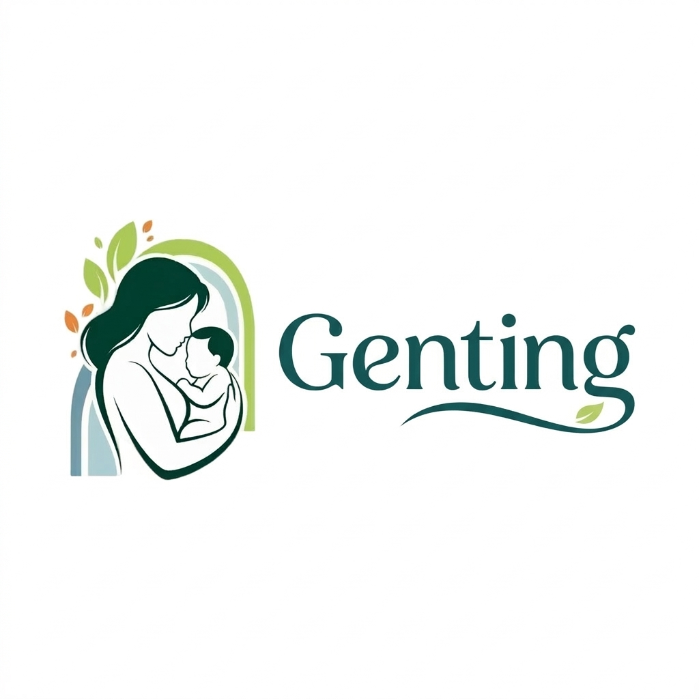

# <div align="center">🤰 GENTING (Generasi Anti Stunting) 👶</div>

<div align="center">
  <h3>"Cegah Stunting Sejak Dini, Wujudkan Generasi Emas Indonesia"</h3>
</div>

<div align="center">
  
</div>

---

## 🌟 Overview

**Genting** (Generasi Anti Stunting) adalah platform kesehatan mutakhir yang dirancang khusus untuk mendampingi ibu hamil dan orang tua dalam memantau tumbuh kembang anak selama periode krusial **1000 Hari Pertama Kehidupan (HPK)**. Dengan mengombinasikan kekuatan **Artificial Intelligence (AI)**, **Gamifikasi**, dan **Telemedicine**, Genting hadir sebagai solusi preventif yang interaktif untuk menurunkan angka stunting di Indonesia.

---

## ✨ Fitur Unggulan

### 🥗 1. AI Nutrition Insight
Gunakan kamera ponsel untuk mengambil foto makanan. AI kami akan menganalisis kandungan nutrisi secara real-time dan memberikan rekomendasi apakah asupan tersebut sudah memenuhi gizi seimbang untuk pencegahan stunting.

### 🎮 2. Gamified Growth Roadmap
Tumbuh kembang tidak lagi membosankan! Pengguna akan menjalani "Quest" harian, mengisi jurnal, dan menyelesaikan aktivitas roadmap untuk mendapatkan XP dan Badge. Semakin tinggi level Anda, semakin baik pemahaman Anda tentang kesehatan buah hati.

### 📚 3. Education & AI Quiz
Akses konten edukasi yang dikurasi langsung oleh tenaga medis. Setelah membaca, bot AI kami akan memberikan kuis interaktif untuk memastikan pemahaman materi. Selesaikan kuis untuk mendapatkan hadiah dalam aplikasi!

### 🩺 4. Smart Telemedicine
Diskusi langsung dengan dokter spesialis anak atau ahli gizi berpengalaman. Jadwalkan konsultasi dan pantau perkembangan rekam medis dalam satu dashboard yang terintegrasi.

---

## 🛠️ Tech Stack & Architecture

Genting dibangun menggunakan teknologi modern untuk memastikan performa tinggi dan skalabilitas:

- **Frontend**: [Next.js 15+](https://nextjs.org/) (App Router), [React](https://reactjs.org/), [Tailwind CSS](https://tailwindcss.com/)
- **Backend & Database**: [Supabase](https://supabase.com/) (Auth, Database, Storage)
- **AI Engine**: [OpenAI](https://openai.com/) / [OpenRouter](https://openrouter.ai/) (GPT-4o / Claude 3.5 Sonnet)
- **Animations**: [Framer Motion](https://www.framer.com/motion/)
- **Security**: Supabase Row Level Security (RLS) & Role-based authentication
- **Payment Gateway**: [Midtrans](https://midtrans.com/) (Integrasi Siap Pakai)

---

## 🚀 Memulai (Get Started)

### Prasyarat
- Node.js 18.x atau lebih baru
- Akun Supabase (untuk Database & Auth)
- API Key OpenAI atau OpenRouter (untuk fitur AI)

### Instalasi

1. **Clone repository:**
   ```bash
   git clone https://github.com/username/genting-apps.git
   cd genting-apps
   ```

2. **Instal dependensi:**
   ```bash
   npm install
   ```

3. **Konfigurasi Environment Variables:**
   Buat file `.env.local` di root folder dan isi dengan variabel berikut:
   ```env
   # Supabase
   NEXT_PUBLIC_SUPABASE_URL=your_supabase_url
   NEXT_PUBLIC_SUPABASE_ANON_KEY=your_supabase_anon_key
   SUPABASE_SERVICE_ROLE_KEY=your_service_role_key

   # AI Configuration
   OPENROUTER_API_KEY=your_openrouter_api_key
   OPENAI_API_KEY=your_openai_api_key

   # Payment (Midtrans)
   NEXT_PUBLIC_MIDTRANS_CLIENT_KEY=your_client_key
   MIDTRANS_SERVER_KEY=your_server_key
   ```

4. **Jalankan Aplikasi:**
   ```bash
   npm run dev
   ```
   Aplikasi akan berjalan di `http://localhost:3000`.

---

## 🛡️ Keamanan & Kepatuhan
Aplikasi ini telah melewati audit keamanan internal yang ketat, termasuk:
- Validasi service layer dengan `assertAuthenticated` dan `assertRole`.
- Penanganan error yang tersentralisasi untuk pengalaman pengguna yang mulus.
- Enkripsi data sensitif pengguna menggunakan standar industri.

---

## 🏆 Partisipasi Lomba
Proyek ini diajukan untuk kompetisi **[Nama Lomba Web Development]**. 
Kami percaya bahwa teknologi dapat menjadi jembatan untuk masa depan anak Indonesia yang lebih sehat dan cerdas.

---
<div align="center">
  Dibuat dengan ❤️ oleh <b>Tim GENTING</b>
</div>
